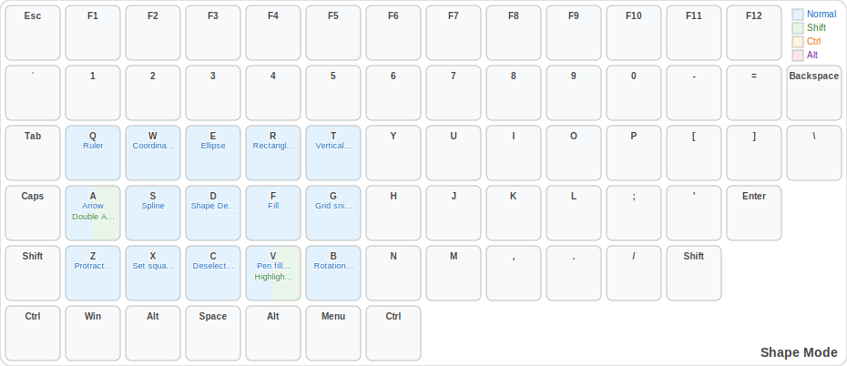

# Key bindings

## Global bindings

* Mode Menu: `Tab`

## color mode

*Note: This shows the static color palette. In newer versions, colors are loaded dynamically from Xournal++'s current palette.*

* Pink: `q`
* White: `w`
* Red: `r`
* Black: `x`
* Cyan: `c`
* Green: `g`
* Blue: `b`
* Refresh color keybindings: `<Ctrl>r`
* Orange: `o`
* Purple: `p`, `a`
* Yellow: `y`

## edit mode

* Font: `w`
* Lasso Selection: `e`
* Rectangle Selection: `r`
* LaTeX: `s`
* Image: `d`
* Text: `f`

## file mode

* Quit: `q`
* New: `w`
* Export as PDF: `e`
* Open: `r`
* Annotate PDF: `a`
* Save: `s`
* Print: `d`
* Export as: `<Shift>e`
* Save As: `<Shift>s`

## mode mode

* Page Mode: `q`
* Layer Mode: `w`
* Edit Mode: `e`
* Shape Mode: `s`
* File Mode: `f`
* Color Mode: `c`
* Navigation Mode: `v`
* Tool Mode: `t`, `Tab`
* Sticky Page Mode: `<Shift>q`
* Sticky Layer Mode: `<Shift>w`
* Sticky Edit Mode: `<Shift>e`
* Sticky Shape Mode: `<Shift>s`
* Sticky File Mode: `<Shift>f`
* Sticky Color Mode: `<Shift>c`
* Sticky Navigation Mode: `<Shift>v`

## navigation mode

* Go to Top: `g`
* Go to Bottom: `<Shift>g`
* Scroll Page Down: `<Ctrl>d`
* Layer Down: `j`
* Layer Up: `k`
* Zoom Out: `<Ctrl>minus`
* Zoom In: `<Ctrl>plus`
* Scroll Page Up: `<Ctrl>u`

## page mode

* Ruled Background: `r`
* Dotted Graph Background: `d`
* Copy Page: `c`
* Graph Background: `g`
* Isometric Graph Background: `i`
* Move Page Down: `j`
* Move Page Up: `k`
* New Layer: `l`
* New Page After (Quick Access): `m`
* New Page After: `o`
* Plain Background: `p`
* Isometric Dotted Graph Background: `<Shift>i`
* New Page Before: `<Shift>o`

## shape mode

* Ruler: `q`
* Coordinate system: `w`
* Ellipse: `e`
* Rectangle: `r`
* Arrow: `a`
* Spline: `s`
* Shape Detector: `d`
* Fill: `f`
* Protractor: `z`
* Set square (triangle): `x`
* Deselect all shape tools: `c`
* Pen fill opacity: `v`
* Vertical Space: `t`
* Grid snipping: `g`
* Rotation snipping: `b`
* Double Arrow: `<Shift>a`
* Highlighter fill opacity: `<Shift>v`
* Grid snipping off: `<Shift>g`
* Rotation snipping off: `<Shift>b`

## tool mode

* Previous Color: `q`
* Pen: `w`
* Eraser: `e`
* Next Color: `r`
* Cycle Linestyle: `a`
* Rectangle Selection: `s`
* Select Linear Text: `d`
* Highlighter: `f`
* Undo: `z`
* Cut: `x`
* Copy: `c`
* Paste: `v`
* Fine: `t`
* Medium: `g`
* Thick: `b`
* Laser Pen: `<Shift>w`
* Set Plain Linestyle: `<Shift>a`
* Lasso Selection: `<Shift>s`
* Hand (Scroll): `<Shift>d`
* Laser Highlighter: `<Shift>f`
* Redo: `<shift>z`
* Delete: `<Shift>x`
* Very Fine: `<Shift>t`
* Very Thick: `<Shift>b`
